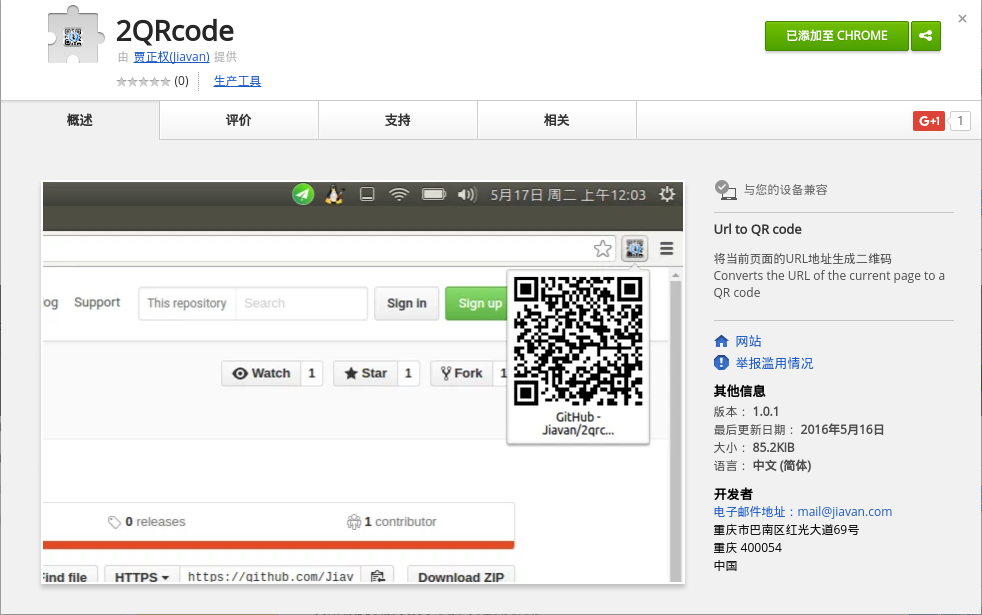

# 2QRcode
将当前窗口生成二维码的Chrome插件！只需要在当前页面点击插件即可生成二维码，通过手机/Pad扫描，转移到移动端浏览。

# Install
## 通过Chrome Store
https://chrome.google.com/webstore/detail/2qrcode/plpmkgbnfajfbjklnndebkbbplfjjcei
或者直接在store搜索**2QRcode**

## 通过GitHub
0. 先克隆这个repo： `sudo git clone https://github.com/Jiavan/2qrcode.git`
1. 在chrome地址栏输入`chrome://extensions/`
2. 勾选开发者模式，点击`加载已解压的扩展程序`，选择刚clone的文件夹
3. done

# Original intention
因为平时在Ubuntu下工作，有时想把浏览器上的页面转移到手机/Pad上查看就觉得非常的不方便。短一点的url可以自己输入，但是长一点的地址就手动转换成二维码，感觉灰常麻烦，就写了这样一个扩展==!

# Dependencies
- jQuery
- QRCode.js

# License
MIT
